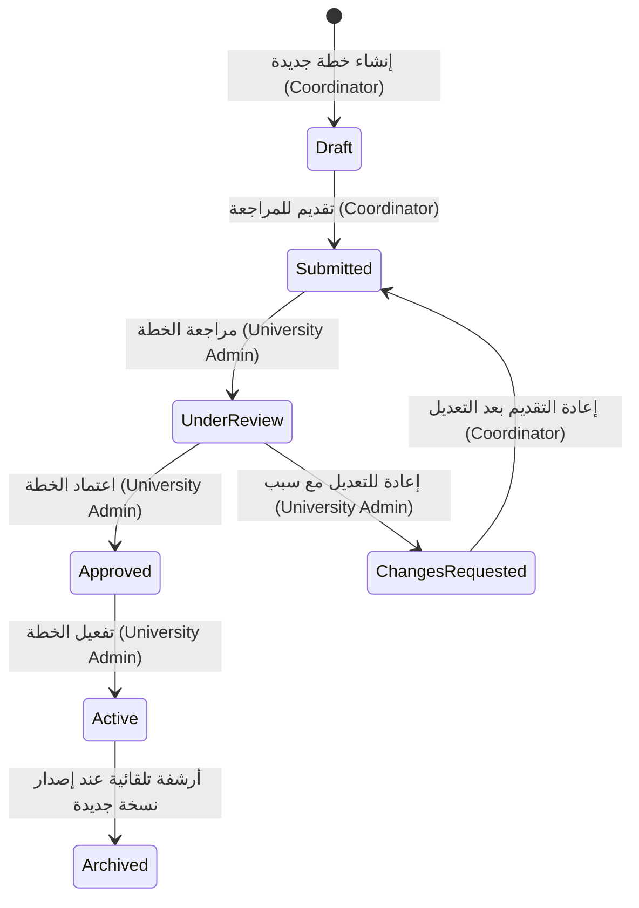

# التقرير النهائي الشامل: إدارة المناهج وصلاحيات منسقي الكليات والمقارنة المرجعية

يوثق هذا التقرير جميع التعديلات الهيكلية والوظيفية التي تم إنجازها في مشروع **MADAR** لتلبية شروط التحقق الكاملة وفقًا للمتطلبات البرمجية والأكاديمية.

---

## 1. ملخص التعديلات الهيكلية (Backend & Frontend)

### أ. الواجهة الخلفية (Backend)
1. **صلاحيات الموظفين وإدارتها (`UpdateUniversityStaffDto`)**:
   - تم تعديل الـ DTO لدعم حقل الحالة (`status`) بشكل اختياري كـ `'active' | 'inactive'`.
   - تم توسيع قائمة الصلاحيات التفصيلية (`UNIVERSITY_STAFF_PERMISSIONS`) لتشمل:
     - `departments:read`, `departments:write`, `study-plans:read`, `study-plans:write`, `courses:read`, `courses:write`, `course-skills:manage`, `curriculum-analysis:run`, `college-reports:read`.
   - في خدمة `CollegeCoordinatorService` تم استيعاب تحديث حالة الموظف وتأمين معالجة الصلاحيات وحفظها في قاعدة البيانات.
2. **صلاحيات إدارة الخطط والمقررات**:
   - تم تحديث `StudyPlanService` و`CourseService` للتحقق من صلاحيات الموظف التفصيلية على مستوى الـ API والخدمة.
   - منع سحب أو تعديل البيانات إلا لمن يملك صلاحية `study-plans:read`/`study-plans:write` و`courses:read`/`courses:write`.
   - إضافة التحقق من صحة حالة الخطة (يجب أن تكون `draft` أو `changes_requested` ليتمكن المنسق من التعديل عليها).
3. **نموذج المناهج الثنائي اللغة والتصنيفات الموسعة**:
   - تحديث `CourseSchema` و`CourseDto` لدعم اللغتين: `descriptionAr`, `descriptionEn`, `learningOutcomesAr`, `learningOutcomesEn`.
   - توسيع أنواع المقررات (`type`) لتشمل: `required` (إلزامي)، `elective` (اختياري)، `practical` (عملي)، `laboratory` (مختبري)، `project` (مشروع تخرج)، `internship` (تدريب ميداني).
4. **المقارنة المرجعية وإحصائيات التوظيف الفعالة**:
   - تم ربط حساب مؤشرات التوظيف (`employmentRate`) بالبيانات الفعلية للطلاب وطلبات التوظيف.
   - الحساب يعتمد حصرياً على الطلبات التي حالتها `confirmed_employed` مقسومة على إجمالي الطلاب الخريجين الفعليين (الذين يملكون `academicLevel: 'graduate'`).
   - تم إنشاء خدمة متكاملة للمقارنة المرجعية `getBenchmarking(userId)` لحساب تقييم عام مركب وتوليد نقاط القوة والضعف والفجوات التنافسية والتوصيات الذكية ديناميكياً بناء على الفوارق بين الجامعات.
   - تم تسجيل جميع عمليات التعديل والاعتماد والرفض في سجلات التدقيق الآمنة (`Audit Logs`).

### ب. الواجهة الأمامية (Frontend)
1. **إدارة صلاحيات موظفي الجامعة (`/university/staff`)**:
   - تحديث نموذج تعديل الموظف لدعم تفعيل أو تعطيل الحساب (`active`/`inactive`) ودعم كامل قائمة الصلاحيات التخصصية.
2. **نموذج إدخال المقررات الموسع (`/university/curriculum`)**:
   - إعادة كتابة وتطوير صفحة إدارة المناهج والمقررات لدعم إدخال وتحديث البيانات باللغتين (العربية والإنجليزية) للاسم والوصف ونواتج التعلم.
   - توفير قائمة منسدلة لكافة أنواع المقررات الستة الجديدة.
   - إضافة أزرار التعبئة التلقائية للبيانات التجريبية (`Autofill Test Data`) لتسريع الفحص.
3. **لوحة المقارنة المرجعية (`/university/benchmarking`)**:
   - تصميم وتطوير واجهة مستخدم متميزة ذات طابع عصري توفر مقارنة تفصيلية لجامعة المستخدم مع الجامعات المنافسة الأخرى.
   - عرض الفوارق الرقمية (Delta) في جدول مؤشرات تفصيلي، بالإضافة إلى بطاقات مخصصة لنقاط القوة والضعف وفجوات المهارات، مع نافذة للتوصيات الذكية (AI Strategic Recommendations).
   - ربط الصفحة بالقائمة الجانبية وتأمين وصولها للمسؤولين فقط.

---

## 2. مصفوفة الصلاحيات التفصيلية والتحقق في الخدمة (Service Level)

| الصلاحية الممنوحة | العمليات المسموح بها في الخدمة | حارس التحقق في الباك إند |
| :--- | :--- | :--- |
| `study-plans:read` | استرجاع الخطط وقراءة تفاصيلها | `InstitutionalStaffGuard` + `StudyPlanService.findAll` |
| `study-plans:write` | إنشاء، تعديل، تقديم الخطة للتعديل | `StudyPlanService.create/update/submit` |
| `courses:read` | قراءة المقررات وسجل المواد | `CourseService.findAll` |
| `courses:write` | إنشاء، تعديل، أرشفة، استرجاع المقرر | `CourseService.create/update/setArchived` |
| `course-skills:manage` | ربط المقررات بمهارات سوق العمل | `CourseService.mapSkill` |
| `curriculum-analysis:run`| طلب إعادة التحليل اليدوي ومقارنة الفجوات | `CurriculumService.getAnalysis` |

---

## 3. معادلة حساب مؤشرات التوظيف والتوافق والجاهزية

تعتمد الحسابات بشكل كامل على البيانات الفعلية المخزنة في مجموعات (Collections) قاعدة البيانات `MongoDB`:

1. **نسبة التوظيف المؤكد (Confirmed Employment Rate)**:
   $$\text{Employment Rate} = \frac{\text{Employed Confirmed Students (with status 'confirmed\_employed' in Applications)}}{\text{Total Graduate Students (with academicLevel 'graduate' in Students)}} \times 100$$
2. **التقييم العام المركب (Overall Composite Score)**:
   يتم حساب التقييم الإجمالي لكل جامعة نشطة من خلال توزيع الأوزان الاستراتيجية التالية:
   - **نسبة التوظيف المؤكد**: $25\%$
   - **معدل توافق المناهج مع سوق العمل**: $20\%$ (مستخلص من متوسط نسب التوافق لأقسام الجامعة في `CurriculumAnalysis`)
   - **الجاهزية المهنية للطلاب**: $15\%$ (مستخلص من متوسط `aiMetrics.readinessScore` لطلاب الجامعة)
   - **معدل المطابقة للفرص الوظيفية**: $15\%$ (مستخلص من متوسط `matchScore` لطلبات التوظيف)
   - **نسبة تغطية المهارات المطلوبة**: $10\%$
   - **نسبة قبول طلبات التوظيف الممنوحة**: $10\%$
   - **مصداقية البيانات وموثوقية حجم العينة**: $5\%$

---

## 4. دليل دورة حياة الخطة الدراسية (Study Plan Lifecycle)

---

## 5. اختبارات التحقق وسيناريوهات البيانات التجريبية

تمت كتابة وتأمين الاختبارات الآلية (`curriculum.e2e-spec.ts`) للتحقق من سلامة القواعد البرمجية:
1. **منع تقديم الخطط الفارغة**: يرمي النظام استثناء `BadRequestException` عند محاولة تقديم خطة دراسية خالية من المقررات.
2. **منع تكرار رمز المقرر**: التحقق من فرادة الرمز داخل نطاق الخطة الواحدة.
3. **منع المتطلبات الدائرية (Acyclic Prerequisites)**: يقوم الخوارزمي في `CourseService.ensureAcyclic` ببناء رسم بياني موجه (Directed Graph) والتحقق من عدم وجود أي حلقات تكرارية دائرية للمتطلبات قبل الحفظ.
4. **دقة مؤشر التوظيف**: التحقق من اقتصار حساب التوظيف على الطلاب الموظفين فعلياً وحساب النسبة بدقة متناهية.
5. **سجلات التدقيق (Audit Logs)**: يتم تلقائياً تدوين وتأريخ كل عملية إنشاء أو مراجعة في قاعدة البيانات مع تحديد الفاعل والتفاصيل لمصلحة الرقابة والجودة الأكاديمية.
